<table>
    <tr>
        <th align="center">Github Statistics</th>
        <th align="center">Steam Activity</th>
    </tr>
    <tr>
        <td align="center">
            <picture>
                
            </picture>
        </td>
        <td>
            <picture>
                
            </picture>
        </td>
    </tr>
</table>

# 👋 Hi, I’m Raphael

---

- 🎓 Graduated high school (*Abitur*, 2025) with top grades in **informatics** (15p, A+) and **mathematics**
- 💻 Passionate developer (Minecraft plugins, full-stack apps, AI experiments)
- 💼 Professional experience in **C#** development
- 👨‍💻 Member of **DragonSoft@GymSL**, a student dev team creating real-world software
- 🌱 Dedicated to building tech that empowers others – from industry to agriculture

---

## 🕒 My Coding Journey

Everything truly started about **three years ago** — so, let’s say around mid-2022. But the seeds were planted much earlier.

---

### 2019: The Redstone Revelation

In 2019, I got my hands on Minecraft for the first time and instantly developed a knack for command blocks and redstone contraptions. Instead of building epic castles, I found myself building logic gates and weird piston machines—basically, my first taste of programming (without writing any code).

---

### 2021: Plots, Plugins & the Great Realization

Fast forward to around 2021, I joined my first multiplayer server and was amazed by features like plots and region systems. Naively, I thought these were all built with command blocks (“how many command blocks does it take to make this magic?”). When I finally asked, the owner dropped the truth: “No, that’s plugins. Written in a real programming language.” That got my attention—but also overwhelmed me, so I quickly lost motivation.

---

### 2022: First Steps, Big Stumbles & a Shoutout

About a year later, a developer ([mfnalex](https://github.com/mfnalex)) joined the server and gave me a helping hand. My first “real” plugin was born: the more XP you have, the bigger the world border—straight out of BastiGHG’s videos. It wasn’t much, but it gave me fresh confidence.

Inspired, I dove into my own Bedwars plugin. Object-oriented programming? Forget it—each bed had its own class. Async code? Not in my world. You can imagine how that went. Then I started experimenting with networking—my first console game had a client and server, but every action opened a brand new socket. (Yes, you read that right. One socket per action. Wild, but true.) But in my blissful ignorance, I was happy.

---

### 2022/23: School, Informatics & Harsh Realities

Then came the EF year (first year of the German upper school). Thanks to my tinkering, I was ahead in informatics class and aced oral exams (A+). But then came the shocker: my first written exam, a D- (4-). Ouch. To be fair, it was my first real informatics exam and I skimmed questions or answered halfway. Lesson learned. My second exam? Smashed it with an A+.

---

### 2023: Course Choices, Fiverr Hustle & The “Client from Hell”

That’s when it was time to choose my Abitur subjects. My dream was Math and Informatics as advanced courses (LK), and Geography and English as the third and fourth (oral) subjects. But alas, not enough students for an Informatics LK. I picked Physics as my second LK; Informatics had to stay a side subject, with Geography and English rounding out the written/oral mix.

Meanwhile, I started offering my services on Fiverr—and quickly got my first order: a Minecraft HungerGames plugin for €150. The client was super happy… until it came to testing. I could never access the server to try things out; the client always had an excuse, and I’d be kicked off after “just a quick look.” Suspicious, right? Event day came, and despite little testing, the plugin basically worked. I joined the event myself to see it in action and asked players what they thought. Lots of positive feedback, but then the server owner asked why I cared—I explained I’d developed the plugin, and (surprise!) he had no idea. Turns out my client was passing my work off as his own for more money. He got kicked from the team, and I eventually got €100 (after a long wait, and since not everything worked perfectly). Still, a lesson learned: don’t let yourself get scammed, and value your work.  
Fun fact: I spent part of my summer vacation working on that plugin, only to nearly be taken advantage of.

---

### 2023/24: Project Course, DragonSoft@GymSL & Real-World Challenges

Then Q1 began, bringing the “DragonSoft@GymSL” project course in collaboration with PorkyGbR, a feed company. When I heard we’d be digitizing a farm, I imagined conveyor belts, sensors, and wild automation—until I learned the real task: digitizing a vintage scale that still printed on paper. At first, I thought, “That’s it?” But the more I dug in, the more layers I found: user authentication, authorization, data access, databases, and more. Sometimes the “boring” problems are the most interesting.

Meanwhile, informatics class with Mr. Koch was something I actually looked forward to (unlike most of my classmates). No matter the topic, I was there with enthusiasm—and it paid off: a perfect streak of 15 points (A+) throughout the entire qualification phase.

---

### 2024/25: Q2, Teamwork & Graduation

In Q2, teamwork leveled up even more. With DragonSoft, we tackled industry-scale projects like “Tracto-Secure” for TRACTO‑TECHNIK. I took on backend development and software architecture, but also learned how to communicate with real stakeholders and users. All this while juggling informatics class and preparing for finals. Spoiler: I managed to keep my flawless informatics grades to the very end.  
And in the summer of 2025, it was finally done: I graduated (*Abitur*) with top marks in informatics and math—and even more motivation to build tech that’s not just cool, but actually useful.

---

## 🚀 Featured Projects

### 🔐 Tracto‑Secure · Industrial Safety App  
Part of a school–industry collaboration between DragonSoft@GymSL and [TRACTO‑TECHNIK](https://tracto.com/de).  
Developed using ASP.NET Core with a strong focus on usability, safety, and enterprise security.

- 📲 Workers can report hazards digitally and fill in accident reports with photos and structured data
- 🔐 Enterprise stack: **Active Directory**, **JWT Auth**, **Serilog + Kibana + Elasticsearch**
- 🛠️ My role: Backend development, as well as Software-Architecture  
- 🏫 Me as the Lead-Dev working hand in hand with industry stakeholders

📖 [Read more (LokalPlus)](https://www.lokalplus.nrw/kirchhundem/projektkurs-startet-zusammenarbeit-mit-regionalem-unternehmen-90242)

---

### 🐷 Porky · Agriculture meets App Development  
Award-winning project created as part of the **Digigreen** sustainability competition by NRW.Bank.  
Goal: Support small farmers with digital tools for weighing and inventory tracking (Java).

- 📦 Built a **browser-based app** to digitally track feed input/output at pork farms  
- 🌍 Emphasis on **environmental impact** (paperless workflows, cost-saving for small farms)
- 🎥 Presented via **short film & live demo** at NRW.Bank event in Düsseldorf
- 🏅 Awarded €700 among 10 finalist teams; praised for innovation & regional impact

📰 [Read more (LokalPlus)](https://www.lokalplus.nrw/lennestadt/dragonsoft-gymsl-programmieren-fuer-eine-bessere-zukunft-86901)

---

## 🎮 Minecraft Dev & Beyond

I started coding with Minecraft plugins—and it stuck.  
Today I enjoy:
- 🔧 Building robust Paper/Spigot plugins with modern tooling (Paperweight, Gradle)
- 🎮 Making gameplay more interactive through custom events, GUIs & multiplayer logic
- 📈 Applying what I learn across other tech domains (web apps, security, AI)

---

## 💡 Interests & Philosophy

- 🤖 Curious about **AI**, agent-based systems & automation
- 🌐 Interested in digital transformation (especially in under-digitized sectors)
- 💬 I believe in coding with **purpose**, not just for fun—but that helps too 🙂

---

## 🧰 Tools & Tech Stack

**Languages**  

**Frameworks & Libraries**  
- **Java**: Spigot, Paper, Gradle, JDA, IndexedDB  
- **C#/.NET**: ASP.NET Core, Serilog, Autofac, FlurlHttp  
- **General/Other**: JWT, Kibana, Elasticsearch

**Platforms & Tools**  
IntelliJ · Rider · WebStorm · Visual Studio · Git · GitHub · Azure DevOps · Postman · Elasticsearch

---

## 🧑‍💻 About DragonSoft@GymSL

I'm part of the award-winning **DragonSoft@GymSL** team at Gymnasium Lennestadt.  
We develop solutions that solve real problems in agriculture, industry, and safety—while learning enterprise software development and project management skills.

Learn more:  
🌐 [GymSL DragonSoft Initiative](https://gymnasium-lennestadt.de/mint/dragonsoftgymsl-programmieren-fuer-eine-bessere-zukunft/)

---

## 📫 Contact

- 🔗 [github.com/RedReaperLp](https://github.com/RedReaperLp)

---

> _“I don’t just code to solve problems—I code to understand them better.”_
<table>
    <tr>
        <th align="center">Pushed Lines of Code</th>
        <th align="center">Latest <a href="https://lichess.org">Chess</a> game</th>
    </tr>
    <td>
        <picture>
            
        </picture>
    </td>
    <td style="vertical-align: top;">
        <picture>
            
        </picture>
    </td>
    </tr>
    <tr>
        <th align="center">Most used Languages</th>
    </tr>
    <td>
        <picture>
            
        </picture>
    </td>
</table>
